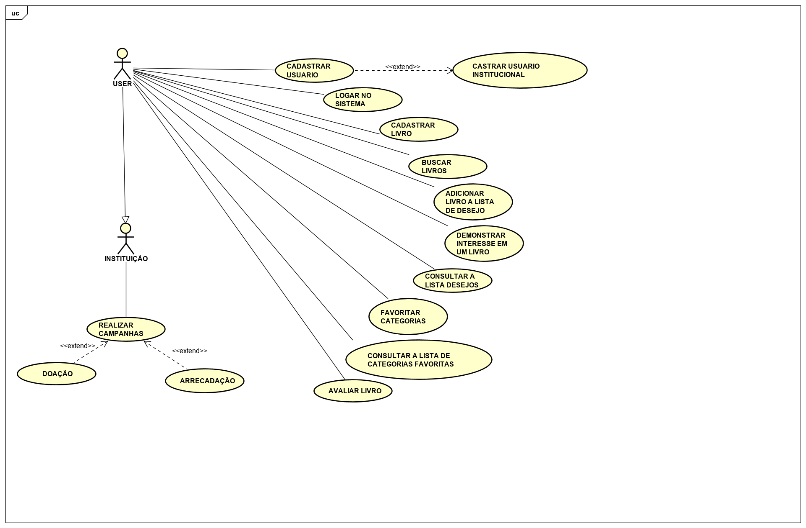

# Documento de visão
# www-doele
## 1. Introdução
### 1.1 Definição Geral do Projeto

Dentro de suas casas, muitas pessoas possuem livros, HQ’s, revistas, artigos e outros tipos de materiais de leitura sobre os mais variados assuntos. Algumas destas pessoas, possuem biblioteca e buscam estar em constante renovação do seu acervo literário; outras têm a leitura como um hobbie e buscam periodicamente livros diferentes e de seu agrado. Além desses tipos de pessoas, há ainda instituições que nem sempre conseguem manter seu acervo literário atualizado e acabam tendo que gastar grandes quantias em busca de materiais novos para o melhoramento do acervo. Para estes problemas, surge o DoeLê!  

O DoeLê é um sistema gratuito que surge para intermediar a doação de livros entre leitores; estes poderão compartilhar seus livros para serem doados e solicitar livros disponíveis para doação. O sistema também vai permitir a criação de campanhas para arrecadação de materiais de leitura para instituições e a criação de gaiolas em locais específicos para a estimulação da leitura. 

Com o DoeLê, é sempre possível multiplicar o conhecimento.

### 1.2 Escopo

**Faz Parte do Escopo**

1. O sistema permitirá que os usuários se cadastrem.
1. O sistema irá diferenciar usuários comuns(pessoas físicas) de usuários institucionais(ONG's, por exemplo).
1. O sistema permitirá que os usuários possam editar seus dados pessoais a fim de atualização cadastral.
1. O sistema permitirá que usuários instituicionais criem campanhas de arrecadação e doação de livros.
1. O sistema permitirá que os usuários vejam os livros anunciados.
1. O sistema permitirá que os usuários pesquisem livros por título e/ou autor.
1. O sistema permitirá que usuários anunciem livros.
1. O sistema permitirá que os usuários demonstrem interesse em doar para uma campanha de arrecadação instituicional.
1. O sistema permitirá que os usuários demonstrem interesse em receber a doação de um livro.
1. O sistema notificará o usuário doador quando um livro anunciado receber uma demonstração de interesse.
1. O sistema permitirá que os usuários envolvidos em uma doação (doador e donatário)confirmem a conclusão da transação(doação) e seja 'dada baixa' no livro a ser doado.
1. O sistema permitirá que os usuários façam avaliações de transações concluídas com sucesso.
1. O sistema permitirá que os usuários façam avaliações de livros.
1. O sistema permitirá que os usuários criem listas de desejo com livros favoritos.

**Não Faz Parte do Escopo**
    
1. O sistema não terá chat para interação entre doador e donatário. 
1. O sistema não será responsável pela entrega dos livros.
1. O sistema não compra e/ou vende livros.
1. O sistema não será responsável pela avaliação do estado físico do livro.
1. O sistema não será responsável pela 'reserva' dos livros anunciados, sendo assim, a confirmação se dará entre os usuários envolvidos(doador e donatário).

## 2. Requisitos

### 2.1 Requisitos Funcionais

| Cod. | Nome | Descrição | Categoria |
| -------- | -------- | -------- | -------- |
| F01 | Cadastro de usuário | O sistema deverá permitir que os usuários possam cadastrar-se no site como doador e/ou donatário. |	Evidente|
| F02 | Cadastro institucional | O sistema deverá permitir que instituições possam cadastrar-se no site como organização doadora e/ou donatária. |	Evidente|
| F03 | Atualização de cadastro de usuário | O sistema deverá permitir que os usuários possam atualizar seus dados de cadastro. |	Evidente|
| F04 | Gerenciamento de campanhas | O sistema deverá permitir que os usuários institucionais possam solicitar a criação/remoção de campanhas de doação/arrecadação. |	Evidente|
| F05 | Gerenciamento de livros | O sistema deverá permitir que os usuários possam cadastrar/remover livros no site | Evidente|
| F06 | Buscar livros | O sistema deverá permitir que os usuários possam buscar livros no site. | Evidente|
| F07 | Gerenciamento de doações | O sistema deverá permitir que os usuários possam 'confirmar interesse' em livros disponíveis para doação e/ou em campanhas de doação/arrecadação. | Evidente|
| F08 | Confirmação de transação concluída | O sistema deverá permitir que os usuários envolvidos em uma doação possam confirmar que a transação foi concluída com sucesso | Evidente|
| F09 | Avaliar transação concluída | O sistema deverá permitir usuários envolvidos em uma doação possam avaliar a transação | Evidente|
| F10 | Avaliar livro | O sistema deverá permitir que os usuários possam avaliar(review) livros | Evidente|

### 2.2 Requisitos não funcionais

| Cod. | Nome | Descrição | Categoria |
| -------- | -------- | -------- | -------- |
| NF01 | Aplicação Web | O sistema será  inicialmente desenvolvida para plataforma Web. | Obrigatório|
| NF02 | Play Framework | O sistema deverá ser desenvolvida utilizando o Play Framework. | Obrigatório|
| NF03 | Envio de e-mails | O Sistema poderá utilizar emails de confirmação para funções como cadastro de usuário e livros, etc. | Desejável|
| NF04 | Banco de dados | O Sistema deverá utilizar um SGBD  | Obrigatório|
| NF05 | Google Books API | O Sistema poderá utilizar a API do Google Books | Desejável|
| NF06 | Login com Redes Sociais | O Sistema poderá utilizar redes sociais como forma de login  | Desejável|

### 2.3 Tabela de Referência - Requisitos

| | NF01 | NF02 | NF03 |
| -------- | -------- | -------- | -------- |
| F01 | X | X |	|
| F02 |  | | X |

### 2.4 Diagrama Geral de Casos de Uso

### 2.5. Casos de Uso

| Cod. | Caso de Uso | Descrição | Classificação |
| -------- | -------- | -------- | -------- |
| UC01 | Cadastrar Usuário | O usuário preenche os dados solicitados no formulário de registro e recebe uma confirmação do cadastro | Primário |
| UC02 | Logar Usuário | O usuário preenche o formulário de login com o email e a senha e é autenticado no sistema | Secundário |
| UC03 | Cadastrar Livro | O usuário logado preenche os dados do livro no formulário de cadastro e recebe a confirmação de que o livro foi cadastrado com sucesso no sistema | Primário |
| UC04 | Buscar Livro | O usuário digita o nome de um livro no campo de busca e o sistema retorna livros que se encaixem com o que foi digitado| Primário |
| UC05 | Adicionar Livro a lista de desejo | O usuário irá buscar um livro que pode ou não estar anunciado para doação e ele poderá o adicionar a lista de desejo | Secundário |
| UC06 | Demonstrar interesse em um livro | O usuario vendo o anuncio de um livro do qual se interessou poderá  demonstrar o interesse nesse livro | Primário |
| UC07 | Consultar a lista de desejos | O usuario aciona o botão de lista de desejo e o sistema retorna com os livros que o usuario anteriormente adicionou | Secundário |
| UC08 | Favoritar categoria | O usuario podera favoritar uma categoria, fazendo isso está categoria será adicionada a lista de categorias favoritas deste usuario | Secundário |
| UC09 | Consultar a Lista de categorias favoritas | O usuario entra na página de categorias favoritas e o sistema retorna com as categorias de livros que o usuario anteriormente favoritou. | Secundário |
| UC10 | Avaliar Livro | O usuario tendo lido o livro ou conhecendo a obra poderá avaliar a leitura. | Secundário |
| UC11 | Realizar Campanha de doação de livros | O usuario cadastrado como instituição poderá abrir uma campanha que terá um formulario solicitando algumas informações como descrição da campanha, o tipo de livro oferecido e o local onde ocorrerá a campanha| Secundário |
| UC12 | Realizar Campanha de arrecadação de livros | O usuario cadastrado como instituição poderá abrir uma campanha um formulario soque terá solicitando algumas informações como descrição da campanha, o tipo de livro que está sendo arrecadado e o local onde ocorrerá a campanha | Secundário |

### 2.6. Tabela de Referência - Casos de uso & Requisitos

| | NF01 | NF02 | NF03 | F01 | F02 | F03 |
| -------- | -------- | -------- | -------- | -------- | -------- | -------- |
| UC01 | X | X | | | X | X |

### 2.7. Atores

| Ator | Descrição |
| -------- | -------- |
| | |  

## 3. Clientes

 Os clientes são leitores, colecionadores de livros e instituições que queiram doar ou receber doações.
